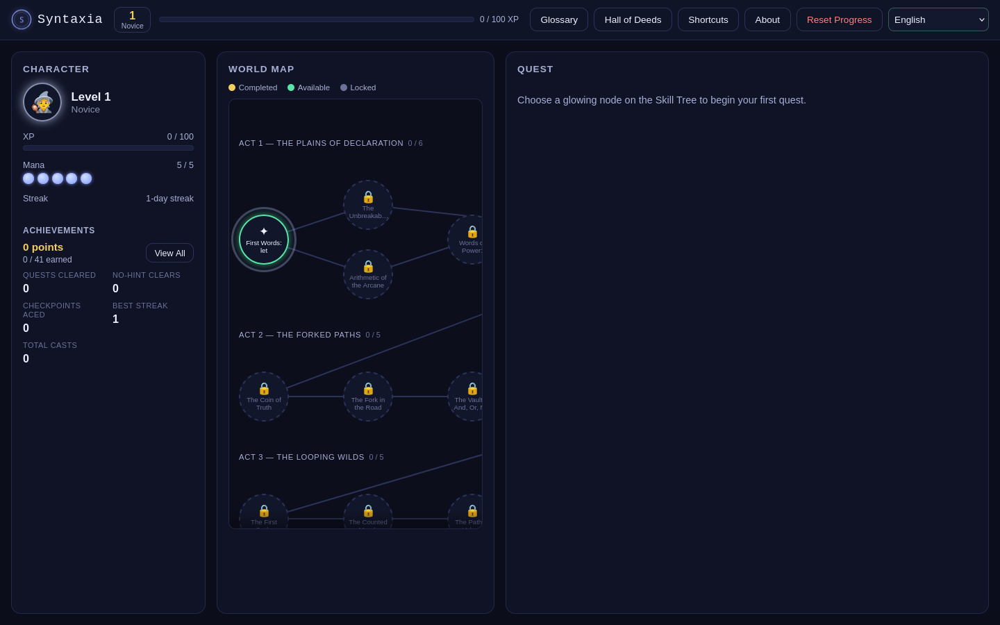
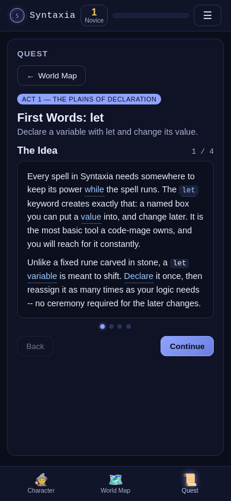
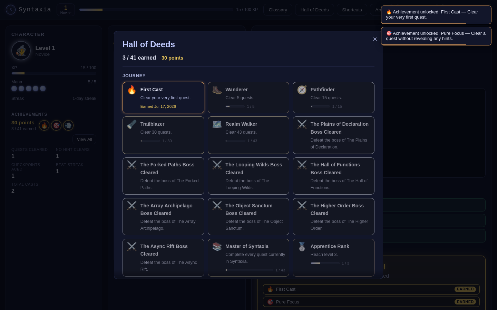

# Syntaxia

Learn JavaScript by playing an RPG. You're a code-mage; spells are real JavaScript, graded by
real tests, in your browser, with nothing to install. There's no account and no server:
your progress lives in your own browser, and the whole game works offline.

**Play now: https://ismetvahidzade986-sketch.github.io/syntaxia-code-rpg/**



## Every quest actually teaches

Most coding games hand you a wall of text and an editor. Syntaxia walks you there:

1. **Step cards** give you the idea in plain words, then a worked example explained line by
   line, then the classic trap for that concept: the wrong belief stated out loud, the bug it
   causes, and the correct mental model.
2. You **predict before you code**. A quick "what will this print?" check, where each wrong
   choice was built around a real misconception. Picking one tells you which.
3. **Failure coaches you.** Test results are a step checklist, and when one fails a coach's
   note explains what that failure usually means ("if you got `undefined`, your function
   computed the value but never handed it back") instead of showing a bare diff.
4. **Any word you don't know is clickable.** 107 programming terms are linked right in the
   lessons, each with a plain-language explanation and a tiny runnable example. There's a
   searchable glossary in the top bar too.

The sequencing follows what MDN, javascript.info, Eloquent JavaScript, and Exercism's JS track
agree on: 8 acts, 43 quests, from variables to async, each act guarded by a boss.



## An RPG that keeps score properly

XP and seven level titles from Novice to Runelord. Mana pays for hints, so reaching for one is
a real decision. Daily streaks. And a **Hall of Deeds**: 41 achievements in bronze, silver,
and gold tiers across six categories (Journey, Mastery, Scholar, Grit, Ritual, plus a few
secret ones), with live progress bars like "no-hint clears: 7/15", earned dates, and a points
total. The
map shows per-act progress and quietly pulses the one quest it recommends next.



## Works like an app

Syntaxia is a PWA. Add it to your home screen and it opens standalone, works with no connection,
and keeps your progress. Phones get a bottom tab bar, a quick-key row above the editor for the
keys mobile keyboards don't have (Tab, braces, parens), and glossary entries that open as a
bottom sheet. Your code runs in a sandboxed Web Worker with a hard 2.5-second timeout, so
`while (true) {}` gets killed with a friendly message instead of freezing the tab.

The interface speaks 20 languages: Spanish, French, German, Portuguese, Italian, Dutch, Polish,
Turkish, Russian, Ukrainian, Arabic (full RTL), Hindi, Indonesian, Vietnamese, Japanese, Korean,
Chinese (Simplified and Traditional), Azerbaijani, and English. Lessons and code stay in English
on purpose: the glossary exists to teach you the English vocabulary of programming, because
that's the one the real world uses.

## Run it locally

There's no build step. You just need a static file server, because the code sandbox runs in
a Web Worker and browsers block those on `file://`:

```bash
git clone https://github.com/ismetvahidzade986-sketch/syntaxia-code-rpg
cd syntaxia-code-rpg
python3 -m http.server 8080   # then open http://localhost:8080
```

## Under the hood

Plain HTML, CSS, and JavaScript, with nothing fetched from a CDN.

| Piece | What it does |
|---|---|
| `js/content.js`, `js/content-extra.js` | Quest data: lessons, steps, checkpoints, tests, solutions. Everything else derives from it. |
| `js/runner.js` | Blob Web Worker sandbox. `function` mode deep-equals return values, `output` mode checks captured `console.log` lines, `assert` mode runs a custom predicate. 2.5s kill switch. |
| `js/engine.js` | Pure game state: XP, quest availability, mana, streaks, stats counters, the achievement catalog, localStorage saves. |
| `js/ui.js` | The skill tree (auto-laid-out from the quest graph), editor, teaching flow, Hall of Deeds, toasts. |
| `js/glossary.js`, `js/i18n.js`, `js/lang.js` | 107 glossary terms, the 20-locale string table, and the runtime that applies both. |
| `sw.js`, `manifest.webmanifest` | Versioned cache-first service worker and the install manifest. |

Lesson HTML passes through a whitelist sanitizer (nine tags, zero attributes) before touching
the DOM. Quest grading in the app and in CI share the same semantics: `node tests/verify.js`
checks the schema, the prerequisite graph, and that every reference solution passes its own
tests, and it runs on every push.

## Writing a quest

Quests are plain data objects. The schema, the act roadmap (spaced review quests, `this` and
prototypes, classes, modules, error handling, DOM, a mastery capstone), and the research the
curriculum leans on are all in [docs/CURRICULUM.md](docs/CURRICULUM.md). Make sure
`node tests/verify.js` passes and open a PR.

## Accessibility

Semantic HTML, keyboard operable end to end, ARIA live regions on everything that changes, AA
contrast throughout, `prefers-reduced-motion` respected, 44px touch targets on coarse pointers,
and code blocks stay left-to-right in RTL locales.

## License

MIT. See [LICENSE](LICENSE).
